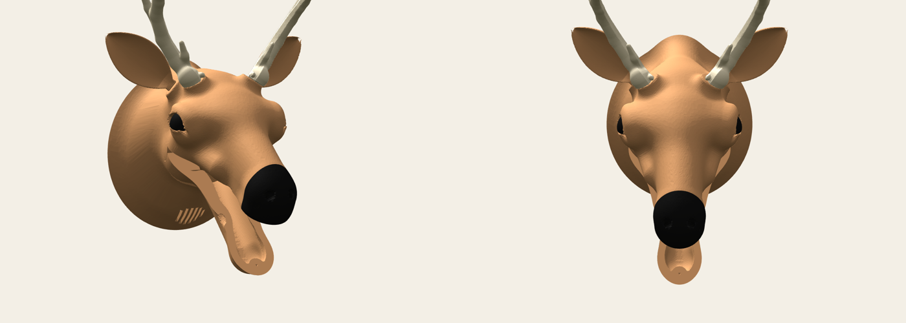

# BUCK

A 3D printed talking deer head. Send it text from anywhere and it says it out loud, moving its jaw in time with the vowels.



BUCK runs on an ESP32-C3 SuperMini with a 9 g servo for the jaw and a small I2S amp. The voice is SAM, the 1982 Software Automatic Mouth, rendered on the chip. Messages come in over USB serial, [CLASP](https://clasp.to), or MQTT, and anyone with curl can make it talk.

One of them hangs on the wall at [HeatSync Labs](https://www.heatsynclabs.org) in Mesa, Arizona. This repo has everything to talk to that one, and everything to print, wire, and program your own.

## Talk to the BUCK at HeatSync

From a terminal, with the curl that ships on macOS and most Linux distros:

```
curl -d "hello from the internet" mqtt://relay.clasp.chat/hackbuild/buck/heatsync/say
```

From a browser: [hackbuild.github.io/hackbuild-buck](https://hackbuild.github.io/hackbuild-buck/) has a text box, a voice picker, and a live view of what BUCK is saying.

From code, with the [CLASP JavaScript client](https://www.npmjs.com/package/@clasp-to/core):

```js
import { Clasp } from '@clasp-to/core';
const buck = new Clasp('wss://relay.clasp.to', { name: 'my app' });
await buck.connect();
buck.emit('/hackbuild/buck/heatsync/say', 'hello deer');
```

From Python, with nothing to install:

```
python3 tools/buck.py say "hello deer"
python3 tools/buck.py say "hello deer" --voice robot
python3 tools/buck.py watch
```

A few things to know before you send:

- BUCK takes 200 characters per message. Longer text is cut.
- It takes four messages at once, then one every three seconds. Extra messages are dropped, not queued.
- Plain English works best. Numbers are read digit by digit, so "10" comes out as "one zero".
- Voices are `sam`, `elf`, `robot`, `stuffy`, `oldlady`, and `et`. Send one to `/hackbuild/buck/heatsync/voice`.
- It is a deer on a wall in a room full of people. Be someone they would want to hear from.

The HeatSync BUCK also announces the lab calendar: an hour before each event, and at 9:30 and 9:45 PM before closing. That runs separately, in [hackbuild/buck-announcer](https://github.com/hackbuild/buck-announcer).

[docs/PROTOCOL.md](docs/PROTOCOL.md) has every address, payload, status value, and limit, with examples for curl, mosquitto, Python, JavaScript, and raw CLASP frames.

## Build your own

You need a 3D printer, about 240 g of PETG, an ESP32-C3 SuperMini, an SG90 servo, the NULLLAB NS4168 amp kit, a USB-C charger, and a soldering iron. [docs/BUILD.md](docs/BUILD.md) walks through the whole thing:

1. Print the parts from `hardware/`. Nothing needs supports.
2. Wire the board, servo, and amp. Five wires and two components.
3. Flash the firmware with [PlatformIO](https://platformio.org).
4. Set WiFi and a name over serial.
5. Calibrate the jaw.

Your BUCK gets its own address, `hackbuild/buck/<your id>/say`, on the same public relays, so it works from anywhere the moment it joins WiFi.

## What is in here

```
src/            firmware: speech, jaw, console, network links
lib/buckproto/  CLASP and MQTT codecs and the text filter, no Arduino, unit tested
lib/sam/        SAM speech synth, with a hook that drives the jaw
test/           host tests: pio test -e native
tools/buck.py   send, watch, and serial console from your computer
web/            the talk page published to GitHub Pages
hardware/       STL and 3MF print files, print card, the BUCK bench design tool
docs/           BUILD.md, PROTOCOL.md, FIRMWARE.md
```

[docs/FIRMWARE.md](docs/FIRMWARE.md) covers how the firmware is put together: the four tasks, how the jaw reads SAM's formants, what happens when WiFi drops or the board crashes, and every serial command.

## License

The firmware links SAM, which is GPL-3.0, so this repository is GPL-3.0. See [LICENSE](LICENSE). SAM is by Don't Ask Software (1982), reverse engineered to C by Sebastian Macke, and ported to the ESP8266 and ESP32 by Earle F. Philhower III.
